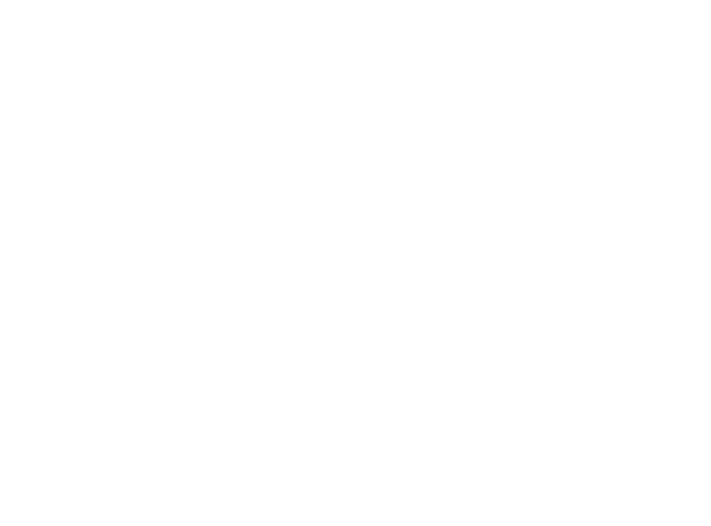

# Project 101

This project was deployed using [Netlify](https://www.netlify.com/). 
To see deployment [click here](https://project101.netlify.app/)

```Project101 is a website that help Students to find the choice for their career espacially in ICT Field. University and College are based in Western Cape, South Africa.```

<!--  -->

This project was implemented using ```Django``` a python framework and ```Bootstrap``` a css framework.


